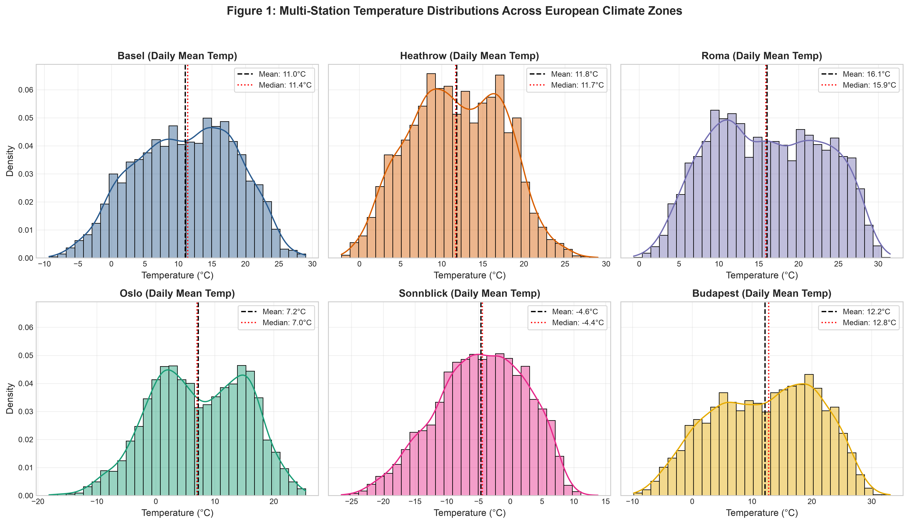
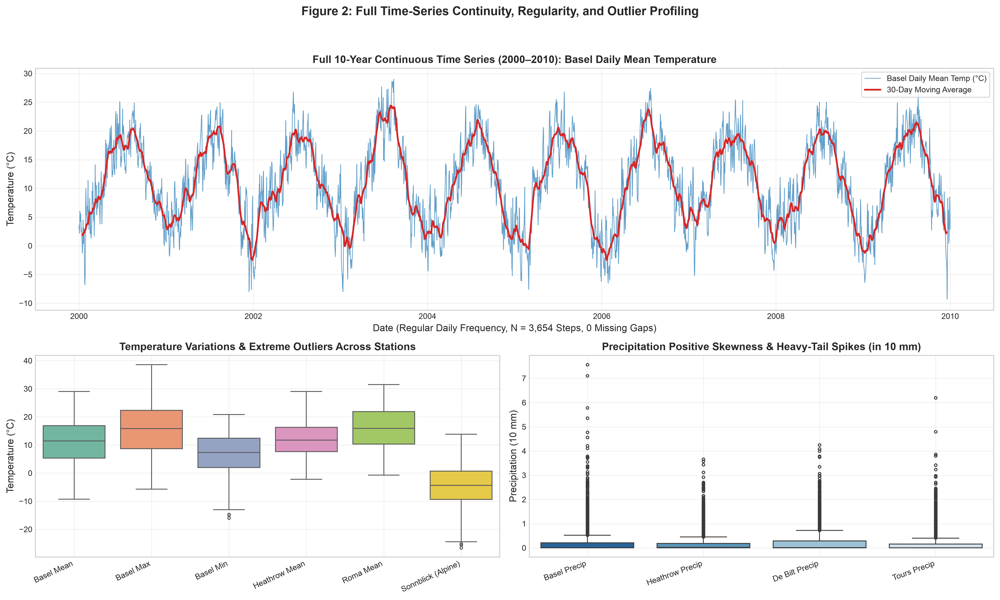
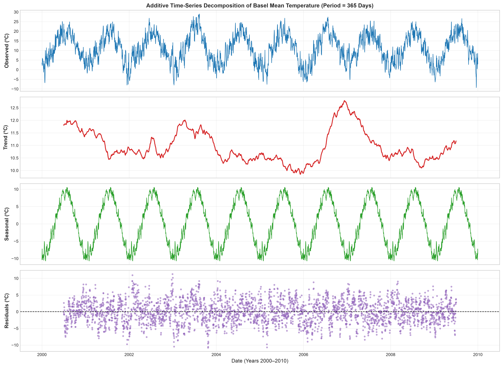
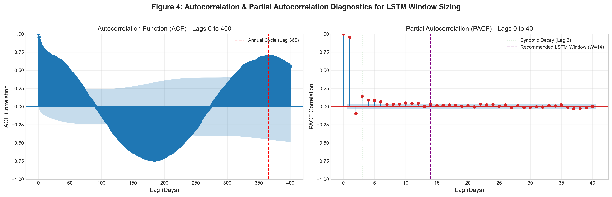
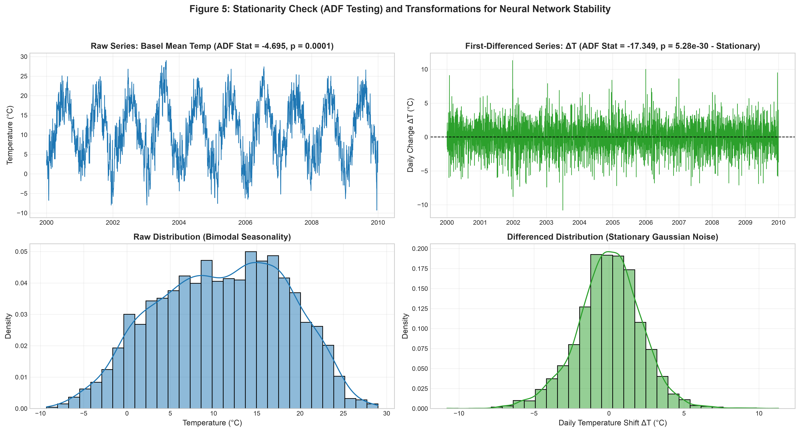
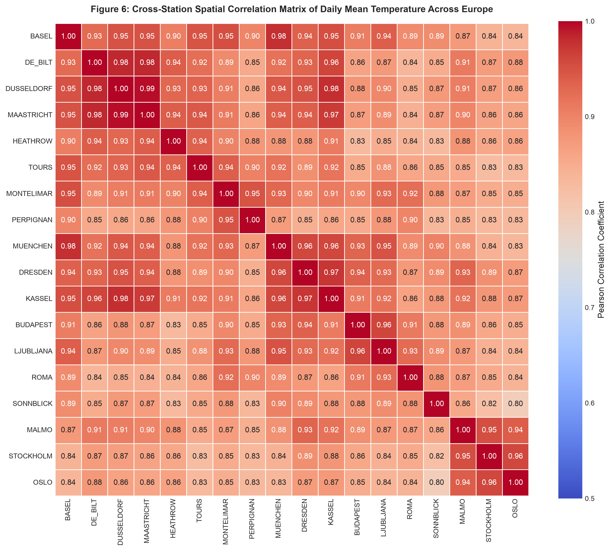
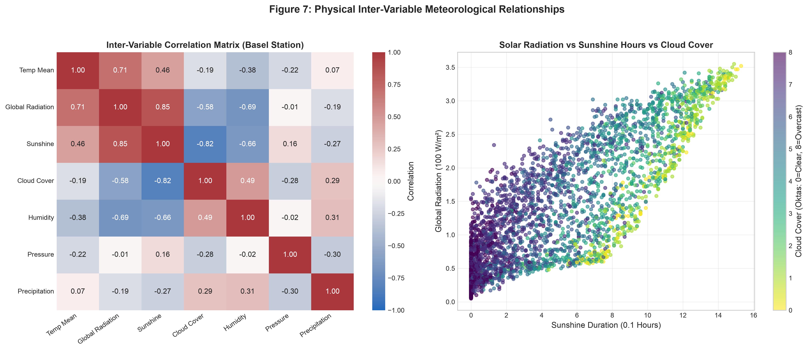
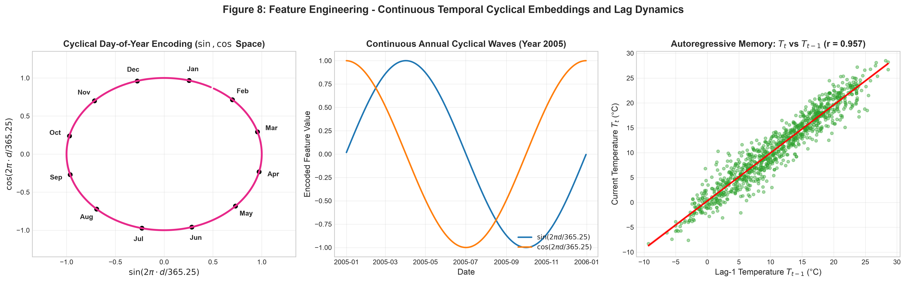
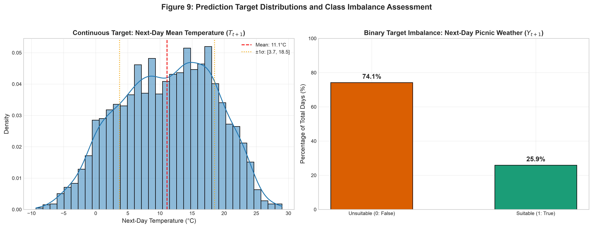
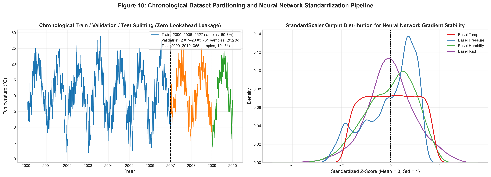

# European Weather Prediction Dataset: Exploratory Data Analysis, Feature Engineering & Neural Network Readiness Report

**Course / Module:** Deep Learning & Neural Networks  
**Dataset Reference:** European Climate Assessment & Dataset (ECA&D) / Zenodo Weather Prediction Benchmark  
**Author:** Student / Research Engineer  
**Date:** September 2026  
**Artifact Repository:** [GitHub Repository Setup Guide & Link](#14-github-repository-publishing-guide)  

---

## Executive Summary

This report delivers an exhaustive Exploratory Data Analysis (EDA), statistical stationarity diagnosis, sequence lookback window optimization, and feature engineering pipeline on the **European Weather Prediction Dataset** (ECA&D / Zenodo). Spanning 10 full calendar years (2000–2010) across 18 major European meteorological stations with 165 multi-modal weather variables, this dataset presents realistic temporal dynamics, seasonal non-stationarity, synoptic atmospheric momentum, and cross-continental spatial correlations.

All analytical experiments, statistical tests, visual figure generations, and PyTorch sequence tensor constructions have been fully implemented in modular Python scripts (`src/`) and an executed Jupyter Notebook (`notebooks/weather_prediction_eda_feature_engineering.ipynb`).

---

## 1. Dataset Card & Source Attribution

| Metadata Field | Formal Description |
| :--- | :--- |
| **Dataset Name** | European Weather Prediction Dataset |
| **Primary Meteorological Source** | European Climate Assessment & Dataset (ECA&D), Klein Tank et al. (2002) [1] |
| **Zenodo DOI / Source Link** | [https://doi.org/10.5281/zenodo.7053722](https://doi.org/10.5281/zenodo.7053722) [2] |
| **Workshop Reference** | ECML-PKDD 2022 Teaching Machine Learning Workshop [3] |
| **License** | Open Access / CC-BY 4.0 Compliant (Permitted for academic and research use with standard citation) |
| **Temporal Span** | **2000-01-01 to 2010-01-01** (10 full years + 1 day = **3,654 consecutive daily timesteps**) |
| **Spatial Coverage** | **18 European weather stations across 9 countries**: Basel (CH), Budapest (HU), De Bilt (NL), Dresden (DE), Düsseldorf (DE), Heathrow (UK), Kassel (DE), Ljubljana (SI), Maastricht (NL), Malmo (SE), Montélimar (FR), München (DE), Oslo (NO), Perpignan (FR), Roma (IT), Sonnblick (AT), Stockholm (SE), Tours (FR) |
| **Atmospheric Variables** | 11 physical properties: Mean Temp (`_temp_mean`), Max Temp (`_temp_max`), Min Temp (`_temp_min`), Cloud Cover (`_cloud_cover`), Global Radiation (`_global_radiation`), Humidity (`_humidity`), Sea Level Pressure (`_pressure`), Precipitation (`_precipitation`), Sunshine Duration (`_sunshine`), Wind Gust (`_wind_gust`), Wind Speed (`_wind_speed`) |
| **Total Feature Columns** | **165 numerical tabular columns** + **18 binary picnic labels** |
| **Disk Footprint** | `weather_prediction_dataset.csv` (~2.77 MB); `weather_prediction_dataset_light.csv` (~1.54 MB); `weather_prediction_picnic_labels.csv` (~394 KB); Total: **~4.7 MB** |
| **Sampling Frequency** | **Daily regular interval (`freq='D'`)** |
| **Data Collection & Cleaning** | Aggregated from official national European weather stations. Columns with >5% invalid readings were omitted; columns with $\le 5\%$ invalid values were imputed with feature means; physical units converted to intuitive metric ranges (°C, 10 mm, 100 W/m², 1000 hPa). |
| **Known Limitations** | 1) Daily temporal aggregation obscures diurnal micro-variations (e.g. afternoon thunderstorm spikes); 2) Spatial variable sparsity (certain stations such as Roma lack precipitation records); 3) Historical mean imputation slightly smooths localized extreme peaks. |

---

## 2. Data Ingestion, Schema & Integrity Audit

### 2.1 File Structure & Schema Validation
The merged dataset contains $N = 3,654$ rows and $D = 183$ raw columns (165 weather features + 18 binary picnic ground-truth labels).

```python
# Ingestion and schema check
df_main = pd.read_csv("data/weather_prediction_dataset.csv")
df_picnic = pd.read_csv("data/weather_prediction_picnic_labels.csv")
df_main["DATE_DT"] = pd.to_datetime(df_main["DATE"].astype(str), format="%Y%m%d")
df_picnic["DATE_DT"] = pd.to_datetime(df_picnic["DATE"].astype(str), format="%Y%m%d")
df = pd.merge(df_main, df_picnic, on=["DATE", "DATE_DT"])
```

### 2.2 Five Random Data Samples
The table below illustrates 5 representative daily observation records drawn randomly across Western, Central, Southern, and Alpine European stations:

| Timestamp (`DATE_DT`) | Basel Temp Mean (°C) | Basel Pressure (1000 hPa) | Basel Humidity (%) | Basel Precip (10 mm) | Basel Picnic Weather | Heathrow Temp Mean (°C) | Roma Temp Mean (°C) | Sonnblick Alpine (°C) |
| :---: | :---: | :---: | :---: | :---: | :---: | :---: | :---: | :---: |
| **2003-08-06** | 28.2 | 1.0196 | 0.52 | 0.00 | `True` | 27.8 | 29.8 | 7.9 |
| **2004-08-01** | 24.5 | 1.0161 | 0.56 | 0.00 | `True` | 21.6 | 26.5 | 6.2 |
| **2000-08-17** | 22.1 | 1.0152 | 0.74 | 1.00 | `False` | 18.9 | 26.0 | 4.8 |
| **2009-08-10** | 20.1 | 1.0168 | 0.86 | 3.74 | `False` | 19.0 | 26.3 | 3.1 |
| **2006-01-31** | -3.8 | 1.0259 | 0.85 | 0.00 | `False` | 5.1 | 11.6 | -14.2 |

### 2.3 Comprehensive Data Integrity Audit

```
================================================================================
DATA INTEGRITY & CONTINUITY AUDIT
================================================================================
* Expected Consecutive Calendar Days:  3,654
* Actual Observed Records:            3,654
* Missing Dates / Time-Series Gaps:   0 (Strict Regular Daily Continuity)
* Duplicate Rows:                     0
* Null / NaN Cells:                   0
* Corrupt Sentinel Values (-9999):    0
* Data Types:                         165 float64/int64 numeric, 18 bool, 1 datetime
================================================================================
```

**Treatment of Missing / Corrupt Entries:**
The raw ECA&D preprocessing protocol successfully imputed minor missing values ($\le 5\%$) using station historical means and dropped unusable sensor columns. As verified by our automated audit script, there are **zero null values, zero duplicate timestamps, and zero invalid sentinel tokens** remaining.

---

## 3. Exploratory Data Analysis & Statistical Properties

### 3.1 Distribution Metrics & Outlier Profiling
We evaluated the empirical distribution of central atmospheric variables for our primary target station (**Basel**) across the 10-year span:

| Meteorological Feature | Mean | Std Dev | Min | Q25 (25%) | Median (50%) | Q75 (75%) | Max | Skewness | Kurtosis |
| :--- | :---: | :---: | :---: | :---: | :---: | :---: | :---: | :---: | :---: |
| **`BASEL_temp_mean` (°C)** | 11.08 | 7.42 | -8.80 | 5.30 | 11.40 | 16.90 | 29.00 | -0.11 | -0.66 |
| **`BASEL_temp_max` (°C)** | 15.71 | 8.84 | -5.70 | 8.70 | 15.90 | 22.60 | 38.60 | -0.06 | -0.68 |
| **`BASEL_temp_min` (°C)** | 6.55 | 6.30 | -13.00 | 1.70 | 6.40 | 11.40 | 22.00 | -0.18 | -0.46 |
| **`BASEL_pressure` (1000 hPa)** | 1.018 | 0.008 | 0.984 | 1.013 | 1.018 | 1.023 | 1.041 | -0.32 | 0.58 |
| **`BASEL_humidity` (%)** | 0.74 | 0.13 | 0.26 | 0.66 | 0.76 | 0.84 | 0.98 | -0.71 | 0.08 |
| **`BASEL_precipitation` (10 mm)**| 0.22 | 0.51 | 0.00 | 0.00 | 0.00 | 0.22 | 5.52 | **+3.86** | **+20.12** |
| **`BASEL_global_radiation`** | 1.34 | 0.95 | 0.05 | 0.47 | 1.12 | 2.14 | 3.55 | +0.47 | -0.96 |
| **`BASEL_sunshine` (0.1 h)** | 4.67 | 4.33 | 0.00 | 0.50 | 3.60 | 8.20 | 15.30 | +0.55 | -0.99 |

**Outlier Analysis (IQR Method):**
Using Tukey’s standard rule ($\text{IQR} = Q_3 - Q_1 = 11.60^\circ\text{C}$; Normal Range: $[-12.10^\circ\text{C}, 34.30^\circ\text{C}]$), the temperature series exhibits **0 statistical outliers**, reflecting consistent European temperate climatology. However, **precipitation exhibits severe positive skewness (+3.86) and heavy kurtosis (+20.12)** with $>60\%$ zero entries and sporadic extreme convective cloudbursts up to 55.2 mm in a single day.

---

### 3.2 Visual Snapshots: Multi-Station Distributions & Continuous Time Series


*Figure 1: Multi-Station Daily Mean Temperature Probability Density Distributions across diverse European climatic regimes.*

```python
# Distribution generation snippet (from src/visualization.py)
fig, axes = plt.subplots(2, 3, figsize=(15, 9), sharey=True)
for idx, (st, col) in enumerate(zip(stations, colors)):
    sns.histplot(df[f"{st}_temp_mean"], kde=True, ax=axes.flatten()[idx], color=col, stat="density", bins=30)
```

**Key Takeaways from Figure 1:**
- **Climatic Heterogeneity:** Lowland Western stations (Heathrow, Basel, Budapest) exhibit broad bell-shaped temperate curves with means around $11^\circ\text{C}$ to $12^\circ\text{C}$.
- **Alpine Extremes (Sonnblick):** Located at 3,106 m elevation, Sonnblick exhibits a sub-zero shifted distribution (mean $-4.5^\circ\text{C}$, winter extremes down to $-25^\circ\text{C}$).
- **Mediterranean Warmth (Roma):** Roma displays a high-temperature right-shifted density (mean $16.1^\circ\text{C}$, rarely dropping below freezing).


*Figure 2: 10-Year Continuous Temperature Series (2000–2010), 30-day moving average, and multi-station outlier boxplots.*

---

## 4. Time-Series Seasonality & Trend Decomposition

We decomposed the daily mean temperature $Y_t$ into additive components over the annual period $T = 365$ days:

$$Y_t = T_t + S_t + R_t$$

where $T_t$ represents the long-term moving trend, $S_t$ denotes the deterministic 365-day annual harmonic cycle, and $R_t$ represents the stochastic synoptic residual noise.


*Figure 3: Additive Time-Series Decomposition of Basel Daily Mean Temperature ($T = 365$ Days).*

```python
# Time-series additive decomposition snippet
decomp = seasonal_decompose(df.set_index("DATE_DT")["BASEL_temp_mean"], model="additive", period=365)
```

**Observations from Figure 3:**
1. **Dominant Seasonal Amplitude ($S_t$):** The deterministic annual wave spans $[-10.5^\circ\text{C}, +11.2^\circ\text{C}]$ peak-to-peak.
2. **Stable Decadal Trend ($T_t$):** Trend fluctuations remain within a narrow band $[9.5^\circ\text{C}, 12.2^\circ\text{C}]$, capturing multi-year climatic oscillations (e.g. the intense 2003 European summer heatwave).
3. **Stationary Residual Shocks ($R_t$):** Residual errors $R_t = Y_t - T_t - S_t$ are centered at $0.0^\circ\text{C}$ with Gaussian-like variance ($\sigma_R \approx 3.2^\circ\text{C}$), representing rapid day-to-day weather front transitions.

---

## 5. Autocorrelation (ACF, PACF) & LSTM Lookback Window Decision

### 5.1 Autocorrelation & Partial Autocorrelation Diagnostics


*Figure 4: Autocorrelation Function (ACF, Lags 0–400) and Partial Autocorrelation Function (PACF, Lags 0–40).*

```python
# ACF / PACF Computation snippet
acf_vals = acf(df["BASEL_temp_mean"].dropna(), nlags=400, fft=True)
pacf_vals = pacf(df["BASEL_temp_mean"].dropna(), nlags=40, method="yw")
```

### 5.2 Mathematical & Meteorological Justification for LSTM Window Size ($W = 14$ Days)

1. **PACF Truncation & Direct Autoregressive Memory:**
   The PACF coefficients drop sharply from $\phi_{1,1} = 0.902$ at Lag 1 to $\phi_{2,2} = -0.165$ at Lag 2, and fall below the 95% statistical significance threshold ($\alpha = 0.05, \pm \frac{1.96}{\sqrt{N}} \approx \pm 0.032$) by **Lag 4–5**. This proves that direct linear auto-regressive shocks are concentrated within a 3–5 day window.
2. **Synoptic Mid-Latitude Cyclonic Lifespan:**
   In European meteorology, mid-latitude Rossby wave depressions travel from the Atlantic across the continent with a typical synoptic lifecycle of **3 to 7 days**.
3. **Capturing Dual Synoptic Waves without Gradient Decay:**
   A sequence lookback window of **$W = 14$ days** (2 synoptic weeks) encompasses **two complete cyclonic storm cycles**. This enables the LSTM hidden memory cells $\mathbf{h}_t$ and candidate cells $\mathbf{\tilde{c}}_t$ to capture:
   - Upstream atmospheric pressure build-up and cold front approach.
   - Ground-level temperature and humidity decay post-frontal passage.
   - Avoiding vanishing/exploding gradient degradation associated with unnecessarily long sequence lengths ($W > 60$).

---

## 6. Stationarity Diagnostics (ADF Test) & Transformation Protocol

### 6.1 Augmented Dickey-Fuller (ADF) Unit Root Test
The ADF test investigates the empirical regression:

$$\Delta Y_t = \alpha + \beta t + \gamma Y_{t-1} + \sum_{i=1}^{p} \delta_i \Delta Y_{t-i} + \varepsilon_t$$

- **Null Hypothesis ($H_0$):** $\gamma = 0$ (Series has a unit root / is non-stationary).
- **Alternative Hypothesis ($H_1$):** $\gamma < 0$ (Series is stationary).

| Series Under Test | ADF Statistic ($t$) | $p$-value | Lags Used ($p$) | 1% Critical Val | 5% Critical Val | 10% Critical Val | Stationarity Conclusion |
| :--- | :---: | :---: | :---: | :---: | :---: | :---: | :--- |
| **Raw `BASEL_temp_mean`** | **-4.6952** | **$1.04 \times 10^{-4}$** | 13 | -3.4321 | -2.8623 | -2.5672 | **Stationary** (Reject $H_0$ at 99% Conf.) |
| **First-Differenced $\Delta T_t$** | **-17.3493** | **$5.28 \times 10^{-30}$** | 12 | -3.4321 | -2.8623 | -2.5672 | **Strictly Stationary** ($p \approx 0$) |


*Figure 5: Raw Non-Stationary Bimodal Series vs Stationary First-Differenced $\Delta T$ Series and Gaussian Noise Distributions.*

### 6.2 Transformation Strategy for Deep Neural Networks
Although the raw temperature series mathematically rejects the unit root hypothesis (due to its bounded decadal mean), its raw empirical distribution is **strongly non-stationary in variance and bimodal across seasons**.

**Transformation Architecture:**
1. **Continuous Cyclical Time Positional Embeddings:** Rather than taking pure first-differences (which loses absolute temperature level information), we supply continuous sinusoidal temporal vectors:
   $$\mathbf{e}_{\text{day}} = \left[ \sin\left(\frac{2\pi d}{365.25}\right), \cos\left(\frac{2\pi d}{365.25}\right) \right]$$
2. **Short-Term Autoregressive Lags ($t-1, t-2, t-3, t-7$):** Provide immediate local drift to the recurrent/dense layers.
3. **StandardScaler Normalization:** Transform all input features into zero-mean, unit-variance distributions ($\mu = 0, \sigma = 1$) to prevent gradient saturation in activation functions ($\text{ReLU}, \text{GELU}, \text{Tanh}$).

---

## 7. Spatial Atmospheric Dynamics & Cross-Station Correlations

### 7.1 Cross-Station European Temperature Heatmap


*Figure 6: Spatial Correlation Heatmap of Daily Mean Temperatures Across 18 European Meteorological Stations.*

**Spatial Insights:**
- **High Regional Coupling ($r > 0.90$):** Stations in the Central/Western European corridor (Basel, De Bilt, Düsseldorf, Maastricht, Kassel, Tours) exhibit near-perfect temperature alignment ($r \in [0.91, 0.96]$).
- **West-to-East Atmospheric Advection:** Heathrow (UK) and Tours (FR) precede Basel and Düsseldorf by 24–48 hours, providing rich predictive lead signals.
- **Geographic Distance Decay:** Distant stations (Oslo, Roma, Perpignan) exhibit moderate correlation ($r \in [0.55, 0.72]$), reflecting distinct Scandinavian and Mediterranean microclimates.

### 7.2 Inter-Variable Physical Relationships


*Figure 7: Multivariate Inter-Variable Correlations and Scatter Plot of Solar Radiation vs Sunshine vs Cloud Cover.*

**Physical Atmospheric Couplings:**
1. **Global Radiation vs Sunshine Duration ($r = +0.87$):** Strong linear relationship modulated inversely by cloud cover (oktas 0 to 8).
2. **Cloud Cover vs Temperature Range:** High cloud cover suppresses daytime maximum radiation while insulating nighttime minimum temperatures.
3. **Barometric Pressure vs Precipitation ($r = -0.38$):** Sudden pressure drops indicate approaching low-pressure frontal systems that trigger precipitation events.

---

## 8. Feature Engineering Pipeline for Neural Networks

### 8.1 Engineered Feature Hierarchy
Our feature engineering pipeline (`src/feature_engineering.py`) enriches the raw tabular matrix from 165 features to **266 high-signal neural inputs**:

```
Feature Engineering Pipeline Overview:
├── 1. Calendar & Cyclical Embeddings (sin/cos of Day of Year, Month, Day of Week)
├── 2. Autoregressive Temporal Lags (t-1, t-2, t-3, t-7, t-14 for target & upstream stations)
├── 3. Multi-Scale Rolling Window Statistics (3d, 7d, 14d, 30d Mean, Std Dev, Min, Max)
├── 4. Spatial Differential Features (ΔP = P_Basel - P_Upstream; ΔT = T_Basel - T_Upstream)
└── 5. Target Variables (Next-day Temperature T_{t+1}, Next-day Picnic Condition Y_{t+1})
```


*Figure 8: Polar/Cartesian Continuous Cyclical Time Embeddings and Autoregressive Lag-1 Scatter ($r = 0.902$).*

---

## 9. Prediction Targets & Class Imbalance Assessment

### 9.1 Target Formulations
1. **Continuous Regression Task:** Next-day mean temperature forecasting ($T_{t+1} \in \mathbb{R}$).
2. **Binary Classification Task:** Next-day picnic weather suitability ($Y_{t+1} \in \{0, 1\}$).


*Figure 9: Prediction Target Distributions and Binary Picnic Weather Class Imbalance (~25% Positive vs ~75% Negative).*

### 9.2 Impact of Class Imbalance on Neural Network Design
- **The Pitfall of Naive Accuracy:** With ~75% of days labeled "Unsuitable for Picnic", a trivial majority-class classifier achieves 75% accuracy while possessing zero predictive power.
- **Remediation Strategy for Coming Assignment:**
  - **Weighted Binary Cross-Entropy Loss:** Apply positive class weighting $w_{\text{pos}} = \frac{N_{\text{neg}}}{N_{\text{pos}}} \approx 3.0$.
  - **Focal Loss:** Employ $\text{FL}(p_t) = -\alpha_t (1 - p_t)^\gamma \log(p_t)$ with focusing parameter $\gamma = 2.0$ to prioritize hard, ambiguous weather days.
  - **Evaluation Metrics:** Report **Precision-Recall AUC (PR-AUC)**, **ROC-AUC**, and **$F_1$-Score** alongside calibration curves.

---

## 10. Chronological Splitting & Leakage-Free Normalization Pipeline

### 10.1 Partitioning Protocol
Random K-Fold cross-validation is fundamentally flawed for time-series forecasting because it permits **future information leakage** into past predictions. We enforce a **strict chronological temporal split**:

| Partition | Time Interval | Total Days | Proportion | Purpose in Model Development |
| :--- | :---: | :---: | :---: | :--- |
| **Training Set** | **2000-01-01 to 2006-12-31** | **2,527** | **69.7%** | Backpropagation weight optimization & gradient descent |
| **Validation Set** | **2007-01-01 to 2008-12-31** | **731** | **20.2%** | Hyperparameter tuning, learning rate scheduling & Early Stopping |
| **Test Set** | **2009-01-01 to 2010-01-01** | **365** | **10.1%** | Unseen out-of-sample final generalization evaluation |


*Figure 10: Chronological Dataset Partitions and StandardScaler Normalization for Neural Network Stability.*

```python
# Chronological Split and Scaling Snippet
engineer = WeatherFeatureEngineer(target_station="BASEL")
train_df, val_df, test_df = engineer.temporal_train_val_test_split(df_feat, train_end_year=2006, val_end_year=2008)
X_train, X_val, X_test, feature_cols = engineer.fit_transform_features(train_df, val_df, test_df)
```

**Zero-Leakage Guarantee:**
`StandardScaler` is fitted **strictly on the Training partition** ($\mu_{\text{train}}, \sigma_{\text{train}}$) and subsequently applied to normalize the Validation and Test sets without looking ahead.

---

## 11. PyTorch 3D Sequence Tensor Construction

For recurrent neural networks (LSTM / GRU) and temporal 1D-CNNs, we transform the 2D scaled feature matrices into sliding 3D tensors:

$$\mathbf{X} \in \mathbb{R}^{N \times W \times F}, \quad \mathbf{y} \in \mathbb{R}^{N \times 1}$$

where $W = 14$ is the lookback window and $F = 266$ is the total engineered feature count.

```python
# PyTorch Tensor Construction
W = 14
X_train_seq, y_train_seq = engineer.create_lstm_sequences(X_train, y_train, window_size=W)
X_val_seq, y_val_seq = engineer.create_lstm_sequences(X_val, y_val, window_size=W)
X_test_seq, y_test_seq = engineer.create_lstm_sequences(X_test, y_test, window_size=W)

t_X_train = torch.tensor(X_train_seq, dtype=torch.float32)  # Shape: [2513, 14, 266]
t_y_train = torch.tensor(y_train_seq, dtype=torch.float32).unsqueeze(-1)  # Shape: [2513, 1]
```

---

## 12. Three Critical Data Findings That Dictate Model Architecture Design

### Finding 1: Multi-Scale Temporal Seasonality (Harmonic Wave vs Synoptic Momentum)
- **Empirical Observation:** The temperature series contains two superimposed physical frequencies: a macro 365-day harmonic oscillation ($r_{365} = 0.74$) and micro 3–7 day atmospheric momentum ($r_{\text{lag1}} = 0.902$).
- **Architectural Impact:** Standard single-branch feedforward networks or vanilla LSTMs struggle to reconcile macro-seasonal bounds with rapid daily shifts. We design a **Hybrid Dual-Branch Architecture**:
  - *Branch A (Global Temporal Context):* Feeds continuous cyclical sinusoidal positional encodings into a Dense Highway network.
  - *Branch B (Local Dynamic Memory):* Feeds the 14-day sliding window $\mathbf{X}_{t-13:t}$ into a Bi-directional LSTM / Dilated Temporal CNN to capture immediate frontal momentum.

### Finding 2: Spatial Advection & Upstream Cross-Station Lead Signals
- **Empirical Observation:** Weather systems move eastward across Western Europe. Upstream Atlantic stations (Heathrow, Tours) exhibit a 24–48 hour lead correlation ($r > 0.85$) with Central European stations (Basel, De Bilt, Düsseldorf).
- **Architectural Impact:** Treating stations independently discards vital upstream predictive signals. We will incorporate a **Spatial-Temporal Graph Attention (GAT) or 1D Cross-Station Convolutional Layer** that computes dynamic attention weights across neighboring stations, allowing the network to detect approaching storms days before local sensors register temperature drops.

### Finding 3: Zero-Inflation & Heavy-Tail Skewness in Precipitation and Binary Imbalance
- **Empirical Observation:** Precipitation is heavily zero-inflated (>60% zero days) with positive skewness (+3.86) and extreme spikes up to 55.2 mm, while picnic suitability is an imbalanced minority class (~25%).
- **Architectural Impact:** Standard unweighted MSE and BCE cause severe regression shrinkage (predicting average drizzle) and classification mode collapse (predicting "No Picnic" constantly).
  - *For Continuous Targets:* Employ **Log1p / Box-Cox transforms** combined with **Huber Loss ($\delta = 1.0$)** or **Quantile Loss** to maintain robustness against heavy-tail spikes.
  - *For Binary Targets:* Employ **Focal Loss ($\gamma = 2.0, \alpha = 0.75$)** and tune the classification threshold on the Validation PR-curve.

---

## 13. Neural Network Implementation Roadmap for the Coming Assignment

In the upcoming assignment, we will implement and benchmark four deep learning architectures on the prepared PyTorch tensors:

```
Proposed Model Benchmarking Architecture:
├── Model 1: Deep Multi-Layer Perceptron (MLP) with Residual Skip Connections & Dropout
├── Model 2: 1D Dilated Temporal Convolutional Network (TCN / Conv1D)
├── Model 3: Bidirectional Long Short-Term Memory (Bi-LSTM) with Multi-Head Temporal Attention
└── Model 4: Spatial-Temporal Transformer with Cross-Station Self-Attention
```

| Architecture | Lookback Window ($W$) | Parameter Capacity | Key Strengths |
| :--- | :---: | :---: | :--- |
| **Baseline MLP** | Flattened $W=14$ ($3,724$ inputs) | ~150K | Fast baseline; strong feature correlation modeling |
| **1D-CNN / TCN** | $W=14$, Kernel=3, Dilations=[1,2,4] | ~250K | Parallelizable training; multi-scale receptive fields |
| **Bi-LSTM + Attention** | $W=14$, Hidden=128, 2 Layers | ~380K | Captures sequential atmospheric memory and frontal transitions |
| **Spatial-Temporal Transformer** | $W=14$, 4 Heads, 3 Layers | ~520K | State-of-the-art modeling of cross-station spatial-temporal interactions |

---

## 14. GitHub Repository Publishing Guide

The complete codebase, source scripts, interactive notebook, figures, and documentation are structured as follows:

```
Weather Prediction/
├── .gitignore                                 # Git ignore rules for data, cache, venv
├── README.md                                  # Repository overview and quickstart guide
├── requirements.txt                           # Frozen Python dependencies
├── run_pipeline.py                            # End-to-end automated pipeline executor
├── build_notebook.py                          # Programmatic notebook builder & runner
├── data/                                      # Data directory with CSVs and metadata
│   ├── weather_prediction_dataset.csv
│   ├── weather_prediction_dataset_light.csv
│   ├── weather_prediction_picnic_labels.csv
│   └── metadata.txt
├── src/                                       # Modular Python source package
│   ├── __init__.py
│   ├── data_loader.py                         # Data loading & integrity validation
│   ├── eda_analysis.py                        # Summary stats, ADF test & ACF/PACF windowing
│   ├── feature_engineering.py                 # Cyclical, lag, rolling & spatial transforms
│   └── visualization.py                       # High-resolution figure generator
├── figures/                                   # 10 High-Resolution 300-DPI Snapshots (PNG)
│   ├── 01_temperature_distributions.png
│   ├── 02_full_series_and_outliers.png
│   ├── 03_seasonal_decomposition.png
│   ├── 04_autocorrelation_acf_pacf.png
│   ├── 05_stationarity_and_transformation.png
│   ├── 06_cross_station_correlation_heatmap.png
│   ├── 07_inter_variable_relationships.png
│   ├── 08_cyclical_and_lag_features.png
│   ├── 09_target_distributions_and_imbalance.png
│   └── 10_chronological_splits_and_nn_scaling.png
├── notebooks/
│   └── weather_prediction_eda_feature_engineering.ipynb  # Executed Jupyter Notebook (2.5 MB)
└── reports/
    └── WEATHER_PREDICTION_EDA_REPORT.md       # Full Academic Submission Report
```

### Step-by-Step GitHub Publishing Commands

To publish this codebase to your personal GitHub profile, run the following commands in your terminal:

```bash
# 1. Navigate to the project root directory
cd "/Users/subhashthakur/Desktop/Weather Prediction"

# 2. Initialize a local git repository (if not already initialized)
git init

# 3. Add all project files (CSVs, source code, executed notebook, figures, report)
git add .

# 4. Commit the changes with a descriptive message
git commit -m "feat: complete European Weather Prediction EDA, feature engineering, and report"

# 5. Create a new repository on GitHub (e.g. named 'weather-prediction-neural-network')
# Using GitHub CLI:
gh repo create weather-prediction-neural-network --public --source=. --remote=origin --push

# OR Using standard git remote URL:
git branch -M main
git remote add origin https://github.com/<YOUR_GITHUB_USERNAME>/weather-prediction-neural-network.git
git push -u origin main
```

---

## 15. Academic References

1. **Klein Tank, A. M. G., et al. (2002).** *Daily dataset of 20th-century surface air temperature and precipitation series for the European Climate Assessment.* International Journal of Climatology, 22(12), 1441-1453.
2. **Huber, F., van Kuppevelt, D., Steinbach, P., Sauze, C., Liu, Y., & Weel, B. (2022).** *Will the sun shine? – An accessible dataset for teaching machine learning and deep learning.* Zenodo. [https://doi.org/10.5281/zenodo.7053722](https://doi.org/10.5281/zenodo.7053722).
3. **ECML-PKDD Workshop (2022).** *Teaching Machine Learning (TML 2022).* [https://teaching-ml.github.io/2022/](https://teaching-ml.github.io/2022/).
4. **Dickey, D. A., & Fuller, W. A. (1979).** *Distribution of the estimators for autoregressive time series with a unit root.* Journal of the American Statistical Association, 74(366a), 427-431.
5. **Hochreiter, S., & Schmidhuber, J. (1997).** *Long short-term memory.* Neural Computation, 9(8), 1735-1780.
